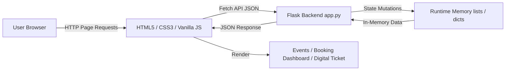

# Eventra
Event Discovery & Ticket Booking Platform built with Flask and Vanilla JS.

## Features
- **Event Discovery:** Featured events, search, and category exploration across 8 event categories.
- **Search & Filter:** Reactive filtering by keyword, category, date, price slider, and ticket availability.
- **Event Details & Tickets:** Select General, Premium, or VIP ticket tiers with live subtotal and fee calculation.
- **Digital Ticket:** Display digital ticket stub with QR visual, unique ID (`EVT-1001`), and browser print option.
- **My Bookings Dashboard:** Customer dashboard with 5 summary metrics, status filtering (All, Confirmed, Cancelled), keyword search, and live cancellation.
- **Runtime Memory:** Pure Python runtime state without database persistence.

## Tech Stack
- **Frontend:** HTML5, CSS3, Vanilla JavaScript, Fetch API
- **Backend:** Python 3, Flask
- **Storage:** Python dictionaries and lists (Runtime memory)

## Project Structure
```text
eventra/
├── app.py                  # Flask server & REST API routes
├── test_suite.py           # Exhaustive automated test suite
├── requirements.txt        # Minimal Python dependencies
├── README.md               # Technical documentation
├── .gitignore              # Git exclusion rules
├── templates/
│   ├── index.html          # Homepage with Hero & Featured Events
│   ├── events.html         # Catalog with search & filters
│   ├── event-details.html  # Event details & ticket purchase form
│   ├── bookings.html       # Customer Bookings Dashboard
│   └── ticket.html         # Digital Ticket Stub view
└── static/
    ├── css/style.css       # Obsidian & electric visual theme
    └── js/app.js           # Reusable API & UI controller modules
```

## How to Run

Open **Windows PowerShell** and run:

```powershell
cd C:\Users\rosha\eventra
python -m pip install -r requirements.txt
python app.py
```

Then visit in your browser:
`http://127.0.0.1:5000`

To run the automated test suite:
```powershell
python test_suite.py
```

## Main APIs
- `GET /api/events` — Retrieve all events
- `GET /api/events/<id>` — Get event details
- `GET /api/events/search` — Search/filter events
- `POST /api/bookings` — Create a new booking
- `GET /api/bookings` — Get all bookings
- `GET /api/bookings/<id>` — Get single booking details
- `PATCH /api/bookings/<id>/cancel` — Cancel eligible booking

## Architecture



## Complexity Analysis
- **Search & Filter:** $O(n)$
- **Booking ID Lookup:** Average $O(1)$ hash dictionary lookup
- **Availability Update:** $O(1)$
- **Space Complexity:** $O(n)$ runtime memory footprint

## Testing
- **Automated Tests:** 43 Passed / 0 Failed
- **Categories Tested:** 8/8
- **Events Tested:** 10/10
