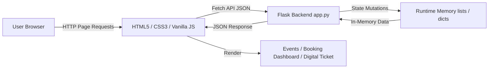

<div align="center">
  <h1>✦ EVENTRA</h1>
  <p><strong>Discover. Book. Experience.</strong></p>
  <p>A Modern Event Discovery & Digital Ticket Booking Platform</p>
</div>

---

## 📌 Project Overview

**Eventra** is a modern, full-stack event discovery and digital ticket booking web application developed for **Web Technology Mini Project 6**. 

The platform offers a complete event discovery and ticketing workflow—allowing users to explore live events across multiple categories, filter by date, price, or category, select custom ticket tiers (*General*, *Premium*, *VIP*), verify real-time availability, calculate totals with transparent booking fee structures, generate digital ticket stubs with QR visual matrixes, and manage reservations via a real-time Customer Booking Dashboard.

---

## ✨ Key Features

- 🎭 **Event Discovery & Catalog:** Featured event showcases and a comprehensive catalog covering 8 event categories (*Music*, *Theatre*, *Comedy*, *Sports*, *Workshops*, *Business*, *Education*, *Festivals*).
- 🔍 **Search & Reactive Filters:** Real-time search across event titles, cities, and venues, paired with category dropdowns, price range sliders, and availability toggles.
- 🎟️ **Multi-Tier Ticket Selection:** Support for *General*, *Premium*, and *VIP* ticket tiers with real-time stock availability tracking and interactive quantity controls.
- 💰 **Transparent Price Calculation:** Live price breakdowns displaying unit prices, selected quantity, subtotal, fixed booking fee, and total booking value.
- 🎫 **Digital Ticket Stub System:** Printable digital ticket stub featuring unique booking IDs (`EVT-XXXX`), status indicators, guest details, demonstrative QR matrix visual, and browser print (`window.print()`) integration.
- 📊 **Customer Booking Dashboard:** Summary metrics (*Total Reservations*, *Confirmed Active*, *Cancelled*, *Tickets Booked*, *Total Booking Value*), real-time status filter tabs (*All*, *Confirmed*, *Cancelled*), keyword search, and live booking cancellation (`Confirmed → Cancelled`) with automated stock restoration.

---

## 🛠️ Technology Stack

| Layer | Technologies |
|---|---|
| **Frontend** | HTML5, CSS3 (Obsidian Dark Theme), Vanilla JavaScript (ES6+), Fetch API, CSS Grid & Flexbox |
| **Backend** | Python 3, Flask Web Framework |
| **Data Storage** | Pure Python Runtime Data Structures (`lists`, `dictionaries`) — *No Database Required* |
| **Typography & Styling** | Google Fonts (*Space Grotesk*, *Plus Jakarta Sans*), Custom Ticket Stub & Glassmorphic Components |

---

## 🏗️ System Architecture



---

## 📁 Project Structure

```text
eventra/
├── app.py                  # Flask application server & REST API endpoints
├── test_suite.py           # End-to-end automated test runner
├── requirements.txt        # Python dependency manifest (Flask>=3.0.0)
├── README.md               # Professional project documentation
├── .gitignore              # Git exclusion rules
├── templates/
│   ├── index.html          # Homepage with Hero, Category Chips & Featured Events
│   ├── events.html         # Event Catalog with reactive search & filters
│   ├── event-details.html  # Detailed event view & ticket selection form
│   ├── bookings.html       # Customer Bookings Dashboard with metrics
│   └── ticket.html         # Digital Ticket Stub view
└── static/
    ├── css/style.css       # Obsidian & electric visual design system
    └── js/app.js           # Reusable API & UI controller modules
```

---

## 🚀 How to Run the Project

### Prerequisites
- Python 3.8 or higher installed on your system.

### Steps

1. **Navigate to Project Directory:**
   ```powershell
   cd C:\Users\rosha\eventra
   ```

2. **Install Required Package:**
   ```powershell
   python -m pip install -r requirements.txt
   ```

3. **Start the Flask Web Server:**
   ```powershell
   python app.py
   ```

4. **Access the Application:**
   Open your web browser and navigate to:
   ```text
   http://127.0.0.1:5000
   ```

---

## 🔌 REST API Reference

| Endpoint | Method | Description |
|---|---|---|
| `/api/events` | `GET` | Retrieve list of all predefined events |
| `/api/events/<event_id>` | `GET` | Retrieve details for a specific event |
| `/api/events/search` | `GET` | Search & filter events by query, category, date, price, or availability |
| `/api/bookings` | `POST` | Submit customer details and create a new booking |
| `/api/bookings` | `GET` | Retrieve all active customer bookings |
| `/api/bookings/<booking_id>` | `GET` | Retrieve single booking details for digital ticket rendering |
| `/api/bookings/<booking_id>/cancel` | `PATCH` | Cancel an eligible booking and restore ticket inventory |

---

## 📄 License & Credits
Developed for **Web Technology Mini Project 6**. Created using Python, Flask, Vanilla JavaScript, and CSS3.
